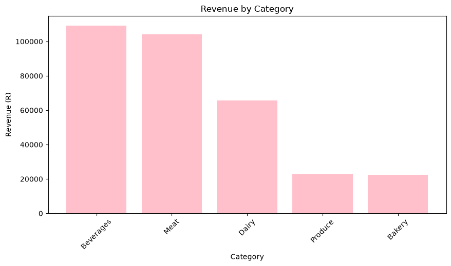

# Retail Sales Analysis

## Project Overwiew
This project analyses retail sales data to understand revenue performance across products, categories, stores, and months. The aim is to identify sales patterns, compare performances, and provide useful insights that can support business decision-making

## Author
**Full Name:** Remofilwe Molehabangwe
**Cohort:** Jan 2026 Data Science Cohort

## Dataset
The dataset used for this project is `sales_data.csv`.
It contains retail transaction information including:
- date
- transaction_id
- product_id
- product_name
- Product category
- store location
- quantity sold
- unit_price
- payment_method
The original dataset contained 600 rows. During the data-cleaning process, 4 rows were removed because of missing quantity, an individual unit price, a negative quantity, and a duplicate transaction.The cleaned dataset contains 569 rows.

## How to run
### Requirements
The project requires Python together with the packages listed in `requirements.txt`.
Install the required packages by running:

pip install -r requirements.txt

## Recommendation
- Investigate the unusually low July revenue and confirm whether the data is complete.
- Review Rosebank's performance using additional measures such as costs, profit, and     customer numbers.
- Evaluate products using both sales volume and unit price when assessing revenue performance
- Continue monitoring category performance to identify changes in demand and pricing

## 8. Tools & Skills Used
**Tools:** Python, Pandas, Matplotlib, Jupyter Notebook, VS Code
**Skills:** Data cleaning, Data manipulation, Aggregation, descriptive analysis, data visualisation, business analysis, reusable functions, and version control.

